# Shoutout-wall

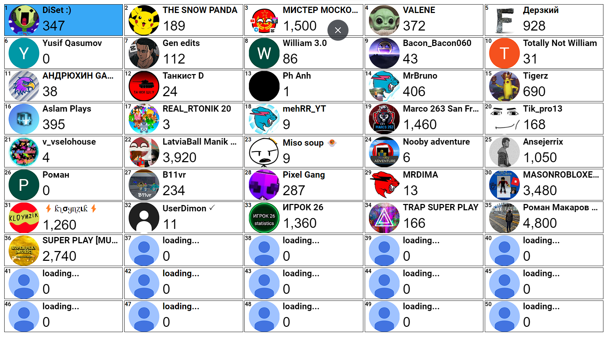

Want to create an automatic Shoutout-wall? Then this repository is for you!

It uses node.js.

**Installation:**
First, you need to install node.js on your computer. To install, click on this [link](https://nodejs.org/en/download).

If you already have it, proceed to the next step. Download or clone the repository to your computer. If you downloaded a zip archive, create a folder on your desktop (or any other location) and unpack the zip archive there.

**Getting API Key:**
To make it work, you need to get your own API key. Follow these steps:
1. Go to [Google Cloud Console](https://console.cloud.google.com/).
2. Click on "New project" and give it any name.

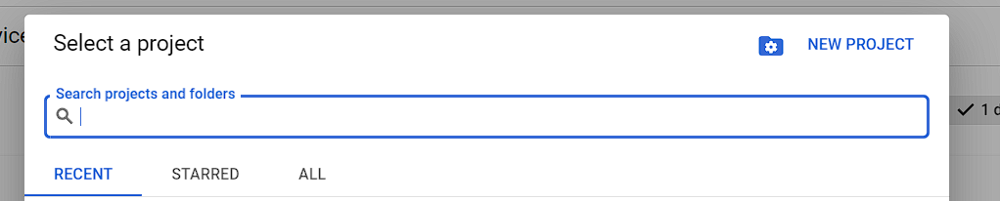

3. Make sure the project is selected.

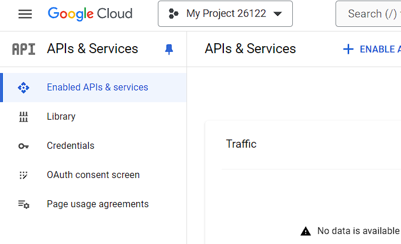

4. Go to "Library" and search for "YouTube Data API v3", then select it.

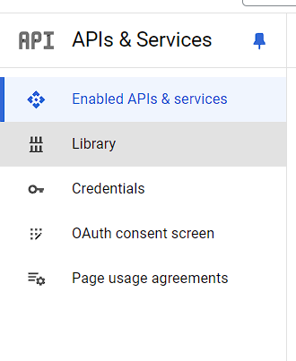
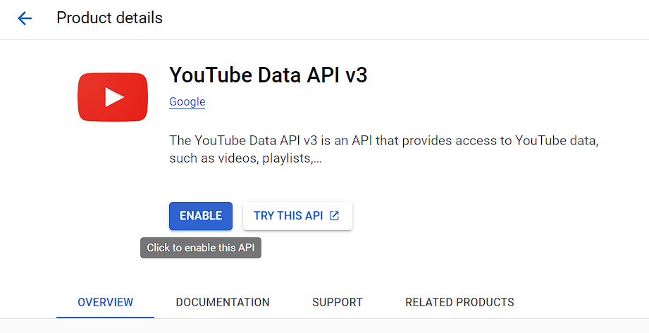

5. Click on "Enable".

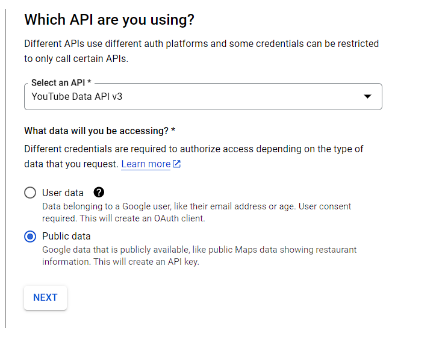

6. Go to "Credentials", click on "Create credentials", and choose "API keys".

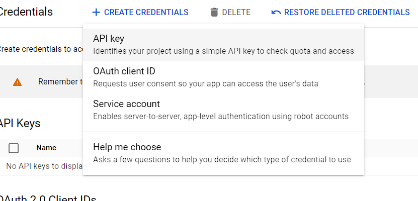

7. Copy the generated API key.

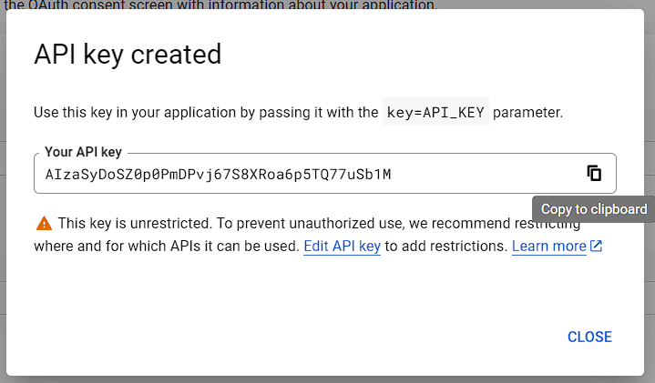

Now, go to the folder with Shoutout wall, navigate to "public" and open "index.html" in any text editor. You will see a section where you need to paste your API key.

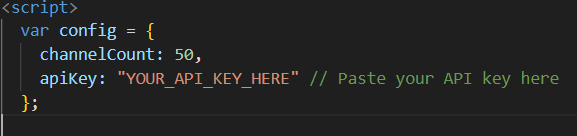

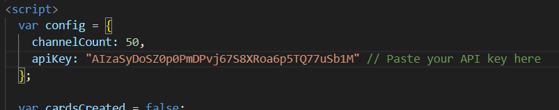

No problem! Here's the updated section about the opening process with the addition of installing necessary packages using npm:

**Opening:**
Now, before starting the Shoutout-wall, we need to install some dependencies. Open cmd, navigate to the directory where Shoutout wall is located (`cd <path_to_shoutout_wall>`), then type `npm install`. This command will install all the required packages automatically.

Once the packages are installed, you can start the Shoutout-wall by typing `node .` in the command prompt. You will see the message as shown in the screenshot. Finally, go to [http://localhost:3000/](http://localhost:3000/) to access the Shoutout wall.

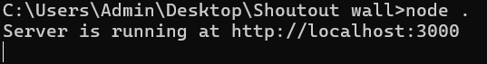
